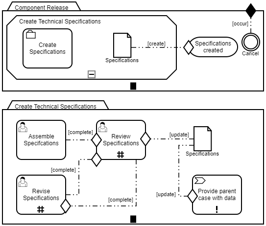

# Installation Instructions for the „Component Release“ Example

The example application „Component Release“ is pre-configured for a MySQL connection and a TomEE application server using EclipseLink as a JPA reference implementation and CXF for processing HTTP-requests to the REST interfaces. The example has been developed and tested in the following environment:

*	[Eclipse Photon Release 4.8.0](https://www.eclipse.org/photon/)
*	MySQL MariaDB 10.1.37 (e.g. via [ApacheFriends XAMPP Version 7.3.0](https://www.apachefriends.org/en/download.html)) 
*	[TomEE PLuME 7.1.0](http://tomee.apache.org/download-ng.html) (built on an Apache Tomcat Version 8.5.32)
*	JRE/JDK 1.8.0_211

# CMMN Case Model "Component Release"

The example application realizes the CMMN case models shown below. There are three HumanTasks in the nested case model "Create Technical Specifications": One is used to assemble specifications, i.e. upload (small <=1MB) files (restricted by the example setup). Another is used to review the uploaded specifications. The last one is basically the first one, but used for revision if necessary. A ProcessTask is used to link the uploaded specifications to the CaseFileItem of the parent case model.

The example highlights the following:

* A Stage with a nested CaseTask
* Milestone which is triggered after completion of the sub-case, triggered by the creation of the CaseFileItem in the primary case
* HumanTasks with repetition decorators
* A ProcessTask to link the uploaded CaseFileItemAttachments with the CaseFileItem of the primary case

Several steps are necessary to run the example. You can either check out the project from here or download the pre-packaged TomEE-distribution from [the project website](https://www.fh-bielefeld.de/wug/forschung/ag-pm/cama-frame). You will need to set up a database and run a JUnit test class to run the example.

## **1.	Import the project:**
You can import the project via a git plugin or the downloaded project archive in Eclipse via File -> Import… and „Import Projects from Folder or Archive“ as a Maven project.

## **2.	Prepare the database:**
Create a MySQL-Database named „componentrelease“. The schema is generated with the help of JPA and by running a JUnit test class. As a JDBC-URL `jdbc:mysql://localhost:3306/componentrelease` is pre-configured.

This configuration can be changed in two places:

a)	In the persistence.xml (see `/ComponentRelease/src/main/java/META-INF/persistence.xml`) of the project

b)	In the TomEE application server (see `tomee\conf\server.xml`)

In a) the `<persistence-unit name="componentreleaseLocal">` is defined. It contains login data and is configured as an application-managed EntityManager which is used in the aforementioned JUnit test class.
  
In b) an application server managed resource is configured as `<Resource name="componentrelease" >` which will later be used by the example. It is also referenced in a) as  `<persistence-unit name="componentrelease">` and contains login data and the URL for your database setup.

_**Note: Should you want to change the name of the persistence unit, you have to change the name accordingly in the class found at /ComponentRelease/src/main/java/cm/core/utils/PersistenceSettings.java and follow the instructions below.**_

## **3.	Run the JUnit test class:**
Once your database is available, run the class `/ComponentRelease/src/test/java/ResetDataBaseTest.java` as a JUnit test. You can watch the table structure being built and the two users being persisted in your console (entries marked with [EL] for EclipseLink).

## **4.	Start TomEE:**
*	If you have **not** changed the database configuration: After you have prepared your database and run the JUnit test class, you can start the application server. If you are not using the bundled distribution, create a deployable .war file from your project and deploy it on the server by copying the file to `tomee\webapps\`.

*	If you **have** changed the database configuration: Undeploy any previous version of the application example in `tomee\webapps\` including any .war-files. Compile the project and create a deployable .war-file. Copy it to `tomee\webapps\`. You should be able to see the deployment being automatically picked up by TomEE in its console.

## **5.	Access the example application:**
You can now access the example application at URL http://localhost:8080/ComponentRelease/welcome. There are two logins available (which were created by running the JUnit test class):

*	„John Admin“ user/pass: admin/admin (has role: reviewer)
*	„Jane Worker“ user/pass: worker/worker (has role: dev)

The worker account can upload specifications and revise them, while the admin account can verify the specifications. Included are simple graphical user interfaces to view case instances and task instances, as well as those used by the HumanTasks. Please note to select a task in the grid first before starting it.
